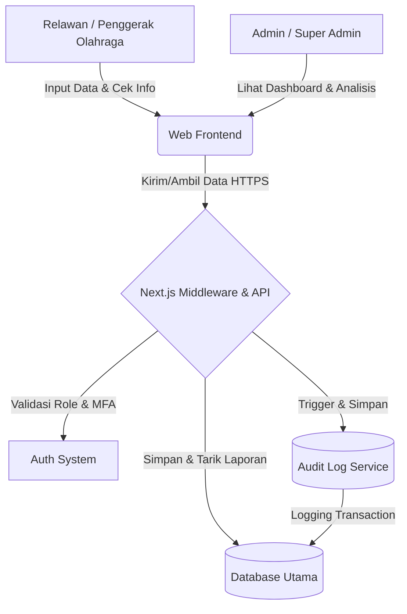

# PRD — Project Requirements Document

## 1. Overview
Saat ini, data mengenai keolahragaan di suatu daerah—seperti jumlah partisipasi masyarakat, kondisi fasilitas, komunitas yang aktif, hingga event dan prestasi—seringkali tersebar dan tidak terorganisir. Hal ini menyulitkan para pemangku kepentingan untuk menganalisis tren dan membuat kebijakan yang tepat sasaran. 

Aplikasi **CPSS (Cloud Participatory Sensing System) Keolahragaan Daerah** hadir untuk memecahkan masalah tersebut. Sistem berbasis website ini berfungsi sebagai wadah tunggal (*single source of truth*) di mana para penggerak olahraga (relawan) dapat melaporkan kondisi riil di lapangan. Dengan semua data terkumpul di satu tempat, admin daerah dapat memantau progres, mencari komunitas, melihat lokasi fasilitas, dan pada akhirnya merumuskan kebijakan keolahragaan yang berbasis data (*data-driven*).

## 2. Requirements
- **Manajemen Hak Akses (Role-Based Access):** Sistem harus mendukung tiga level pengguna, yaitu:
  - **Super Admin:** Mengelola infrastruktur sistem, pengaturan utama, dan manajemen semua admin.
  - **Admin:** Memantau progres daerah, menganalisis data, dan mengelola informasi wilayahnya untuk tujuan pembuatan kebijakan.
  - **Penggerak Olahraga (Relawan):** Aktor utama di lapangan yang bertugas memasukkan (input) data partisipasi, fasilitas, dan event.
- **Kemudahan Akses Ekosistem:** Semua informasi tentang lokasi sarana, aktivitas klub/komunitas, dan event dapat diakses dan dilihat dengan mudah sejak pertama kali pengguna membuka aplikasi.
- **Sistem Pelaporan Tersentralisasi:** Harus mencakup modul pelaporan yang komprehensif (fasilitas, kegiatan rutin, komunitas, prestasi, dan event).
- **Keamanan Tingkat Lanjut (Advanced Security):** Mengingat skala data yang akan terus bertumbuh dan sensitivitas data kebijakan daerah, sistem harus menerapkan:
  - **Multi-Factor Authentication (MFA):** Wajib diaktifkan untuk role `Super Admin` dan `Admin` guna mencegah akses tidak sah即便 kredential utama bocor.
  - **Sistem Audit Log:** Mencatat setiap aksi mutasi data secara otomatis dan terstruktur (siapa yang mengubah, kapan, tabel/baris target, aksi yang dilakukan, serta nilai sebelum dan sesudah perubahan) untuk menjamin integritas dan akuntabilitas data.
  - **Middleware Role Validation:** Validasi hak akses dilakukan di tingkat edge/middleware server sebelum permintaan diproses lebih lanjut, memastikan pemisahan akses yang ketat dan mencegah manipulasi akses via URL atau request manual.

## 3. Core Features
- **Peta & Direktori Keolahragaan (Informasi Cepat):** Fitur untuk langsung melihat lokasi tempat olahraga, daftar komunitas/klub untuk mencari teman, serta jadwal event daerah terbaru.
- **Dashboard Progres Daerah:** Tampilan analitik ringkas bagi Admin dan Super Admin untuk melihat grafik partisipasi masyarakat dan perkembangan keolahragaan dari waktu ke waktu.
- **Pencatatan Partisipasi Masyarakat:** Formulir digital bagi relawan untuk mencatat siapa saja (atau berapa banyak) masyarakat yang sedang berolahraga di suatu area.
- **Manajemen Sarana & Prasarana:** Modul untuk mencatat atau memperbarui kondisi alat olahraga, lokasi aset, status pemakaian, dan informasi kepemilikan sarana daerah.
- **Katalog Komunitas & Prestasi:** Halaman untuk mendaftarkan klub/komunitas olahraga yang ada, lengkap dengan rekam jejak atau prestasi yang telah diraih oleh daerah tersebut.
- **Panel Keamanan & Audit (Opsional/Advanced):** Tampilan khusus bagi Super Admin untuk mengelola status MFA pengguna tinggi dan meninjau riwayat audit log untuk investigasi anomali atau perubahan data kritis.

## 4. User Flow
Berikut adalah alur perjalanan sederhana dari sudut pandang **Penggerak Olahraga (Relawan)**:
1. **Login:** Relawan masuk ke dalam aplikasi menggunakan akun yang telah diverifikasi.
2. **Eksplorasi (Keuntungan Pertama):** Relawan tiba di halaman utama dan bisa langsung melihat peta/daftar sarana olahraga, komunitas yang ada, dan event terdekat.
3. **Pelaporan (Input Data):** Saat berada di lapangan, relawan menemukan sarana yang rusak atau melihat warga yang sedang senam massal. Relawan membuka menu "Tambah Data" dan mengisi laporan terkait.
4. **Verifikasi Sistem:** Data yang dimasukkan langsung tersimpan, tervalidasi oleh middleware, dan terintegrasi ke dalam *database* pusat.
5. **Pemantauan Admin:** Admin daerah membuka aplikasi (dengan MFA jika diperlukan), melihat laporan terbaru dari relawan, meninjau audit log perubahan data, melihat grafik progres daerah, dan menggunakan data tersebut sebagai bahan rapat kebijakan.

## 5. Architecture
Aplikasi ini menggunakan pendekatan arsitektur klien-server berbasis web yang sederhana namun andal. Semua lapisan terintegrasi untuk memastikan data pelaporan dapat masuk secara lancar dan ditampilkan secara *real-time* ke dashboard Admin, dengan lapisan keamanan tambahan di edge.



**Alur Keamanan Tambahan:**
- Setiap request dari frontend pertama-tama melewati **Next.js Middleware** yang memeriksa status otentikasi dan validasi role sebelum meneruskan ke Server Actions/API Routes.
- Untuk role `Super Admin` dan `Admin`, middleware akan memverifikasi status MFA. Jika belum atau gagal, akses ditolak.
- Setiap operasi `CREATE`, `UPDATE`, atau `DELETE` yang mengubah data inti akan memicu mekanisme **Audit Logger** yang mencatat metadata perubahan ke tabel `audit_logs` secara sinkron sebelum transaksi commit.

## 6. Database Schema
Untuk mendukung fitur di atas, aplikasi ini membutuhkan tabel penyimpanan data sebagai berikut:

- **Users:** Menyimpan data pengguna dan hak akses (Super Admin, Admin, Relawan).
- **Facilities (Sarana & Prasarana):** Menyimpan lokasi, kondisi sarana, pemakaian, dan pemilik aset.
- **Clubs (Komunitas/Klub):** Menyimpan profil komunitas, kontak, dan fokus cabang olahraga.
- **Events:** Menyimpan jadwal, lokasi, dan deskripsi acara olahraga daerah.
- **Participations:** Menyimpan log partisipasi warga yang dilaporkan oleh relawan.
- **Achievements (Prestasi):** Menyimpan data penghargaan atau pencapaian yang diraih daerah/klub.
- **Audit Logs:** Menyimpan rekam jejak aktivitas sistem untuk menjaga integritas data dan akuntabilitas perubahan.

```mermaid
erDiagram
    USERS ||--o{ PARTICIPATIONS : "mencatat"
    USERS ||--o{ FACILITIES : "memperbarui"
    USERS ||--o{ AUDIT_LOGS : "memicu"
    
    USERS {
        string id PK
        string name
        string email
        string role "Super Admin, Admin, Relawan"
        boolean mfa_enabled default false
        string mfa_secret nullable
    }
    FACILITIES {
        string id PK
        string name
        string location
        string owner
        string condition "Baik, Rusak Ringan, Rusak Berat"
    }
    CLUBS {
        string id PK
        string name
        string sport_type
        string contact_info
    }
    EVENTS {
        string id PK
        string title
        date event_date
        string location
    }
    PARTICIPATIONS {
        string id PK
        string user_id FK
        int participant_count
        string activity_type
        date log_date
    }
    ACHIEVEMENTS {
        string id PK
        string title
        string description
        date date_achieved
    }
    AUDIT_LOGS {
        string id PK
        string user_id FK
        string action "CREATE, UPDATE, DELETE"
        string target_table
        string target_id
        json old_value
        json new_value
        timestamp created_at
    }
```

## 7. Tech Stack
Berdasarkan kebutuhan pembuatan solusi lengkap, cepat, dan aman untuk menghadapi skala data yang besar, direkomendasikan menggunakan tumpukan teknologi modern sebagai berikut:
- **Frontend / Aplikasi Visual:** Next.js (React) dipadukan dengan Tailwind CSS untuk pengaturan gaya, dan shadcn/ui untuk komponen antarmuka yang siap pakai dan rapi. Integrasi QR Scanner API untuk verifikasi lokasi partisipasi di masa depan.
- **Backend / Logika Sistem:** Next.js Server Actions & API Routes. Dikerangkai dengan **Next.js Middleware** yang berjalan di Edge Runtime untuk validasi role yang cepat, pelacakan sesi, dan penolakan akses awal tanpa membebani server utama.
- **Database:** SQLite (mudah, cepat, dan cukup untuk fase awal daerah) dikelola dengan Drizzle ORM. Tipe data `json` dan `timestamp` digunakan secara optimal untuk tabel `audit_logs` guna menyimpan snapshot perubahan data secara efisien.
- **Keamanan / Otentikasi:** Better Auth sebagai inti otentikasi, dilengkapi dengan modul **TOTP/MFA** native untuk role tinggi. Implementasi **Audit Logger** terintegrasi di layer repository/DRizzle hooks untuk menangkap otomatis setiap mutation tanpa mengganggu logika bisnis utama.
- **Deployment / Peluncuran:** Vercel untuk peluncuran website secara otomatis, dengan leverage pada Edge Functions untuk lapisan middleware keamanan dan cache responsif.