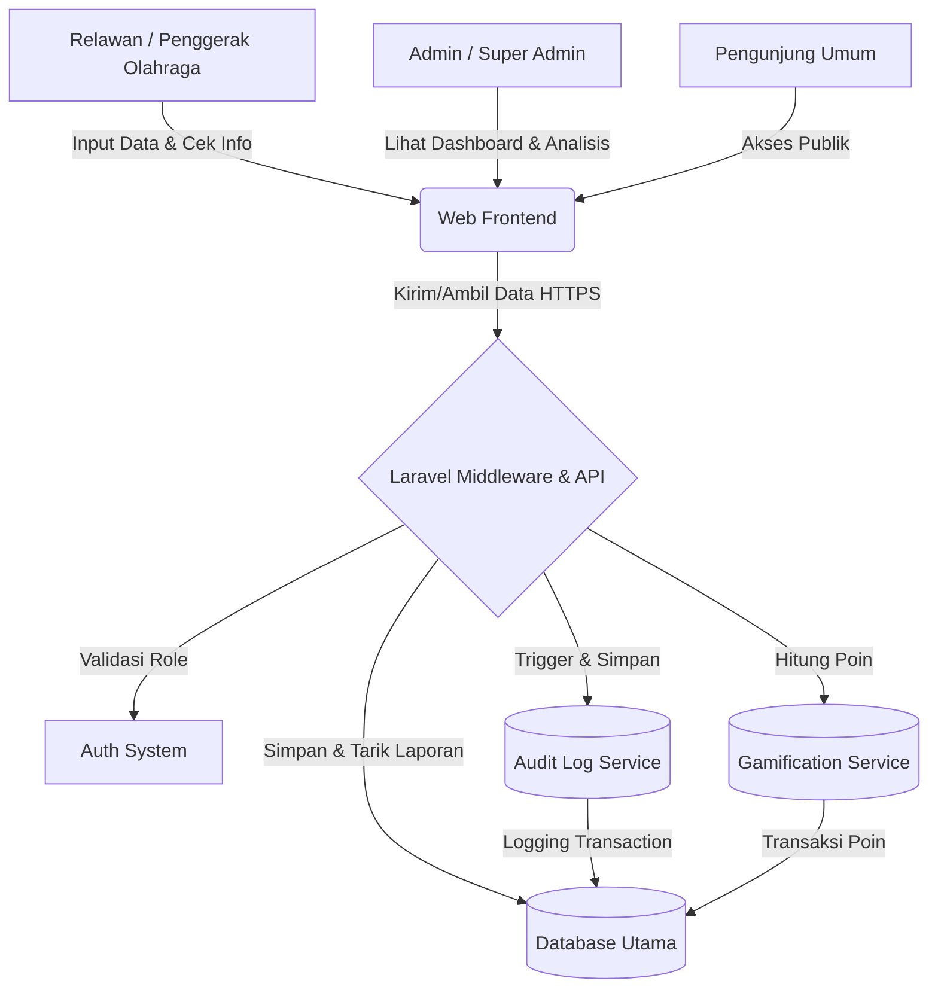

# PRD — Project Requirements Document

## 1. Overview
Saat ini, data mengenai keolahragaan di suatu daerah—seperti jumlah partisipasi masyarakat, kondisi fasilitas, komunitas yang aktif, hingga event dan prestasi—seringkali tersebar dan tidak terorganisir. Hal ini menyulitkan para pemangku kepentingan untuk menganalisis tren dan membuat kebijakan yang tepat sasaran.

Aplikasi **CPSS (Cloud Participatory Sport Sensing System) Keolahragaan Daerah** hadir untuk memecahkan masalah tersebut. Sistem berbasis website ini berfungsi sebagai wadah tunggal (*single source of truth*) di mana para penggerak olahraga (relawan) dapat melaporkan kondisi riil di lapangan. Dengan semua data terkumpul di satu tempat, admin daerah dapat memantau progres, mencari komunitas, melihat lokasi fasilitas, dan pada akhirnya merumuskan kebijakan keolahragaan yang berbasis data (*data-driven*).

Dokumen ini merupakan versi 2.0 yang telah diselaraskan dengan hasil analisis kebutuhan baseline terhadap **476 Tenaga Penggerak Olahraga Nasional** (Mei–Juni 2026) serta kajian prioritas implementasi dan addendum gamifikasi.

---

## 2. Requirements
- **Manajemen Hak Akses (Role-Based Access):** Sistem harus mendukung tiga level pengguna, yaitu:
  - **Super Admin:** Mengelola infrastruktur sistem, pengaturan utama, dan manajemen semua admin.
  - **Admin:** Memantau progres daerah, menganalisis data, dan mengelola informasi wilayahnya untuk tujuan pembuatan kebijakan.
  - **Penggerak Olahraga (Relawan):** Aktor utama di lapangan yang bertugas memasukkan (input) data partisipasi, fasilitas, dan event.
- **Kemudahan Akses Ekosistem:** Semua informasi tentang lokasi sarana, aktivitas klub/komunitas, dan event dapat diakses dan dilihat dengan mudah sejak pertama kali pengguna membuka aplikasi.
- **Sistem Pelaporan Tersentralisasi:** Harus mencakup modul pelaporan yang komprehensif (fasilitas, kegiatan rutin, komunitas, prestasi, dan event).
- **Keamanan Tingkat Lanjut (Advanced Security):** Mengingat skala data yang akan terus bertumbuh dan sensitivitas data kebijakan daerah, sistem harus menerapkan:
  - **Sistem Audit Log:** Mencatat setiap aksi mutasi data secara otomatis dan terstruktur (siapa yang mengubah, kapan, tabel/baris target, aksi yang dilakukan, serta nilai sebelum dan sesudah perubahan) untuk menjamin integritas dan akuntabilitas data.
  - **Middleware Role Validation:** Validasi hak akses dilakukan di tingkat edge/middleware server sebelum permintaan diproses lebih lanjut, memastikan pemisahan akses yang ketat dan mencegah manipulasi akses via URL atau request manual.

---

## 3. Core Features (Existing)
- **Peta & Direktori Keolahragaan (Informasi Cepat):** Fitur untuk langsung melihat lokasi tempat olahraga, daftar komunitas/klub untuk mencari teman, serta jadwal event daerah terbaru.
- **Dashboard Progres Daerah:** Tampilan analitik ringkas bagi Admin dan Super Admin untuk melihat grafik partisipasi masyarakat dan perkembangan keolahragaan dari waktu ke waktu.
- **Pencatatan Partisipasi Masyarakat:** Formulir digital bagi relawan untuk mencatat siapa saja (atau berapa banyak) masyarakat yang sedang berolahraga di suatu area.
- **Manajemen Sarana & Prasarana:** Modul untuk mencatat atau memperbarui kondisi alat olahraga, lokasi aset, status pemakaian, dan informasi kepemilikan sarana daerah.
- **Katalog Komunitas & Prestasi:** Halaman untuk mendaftarkan klub/komunitas olahraga yang ada, lengkap dengan rekam jejak atau prestasi yang telah diraih oleh daerah tersebut.
- **Panel Keamanan & Audit:** Tampilan khusus bagi Super Admin dan Admin untuk meninjau riwayat audit log untuk investigasi anomali atau perubahan data kritis.

---

## 4. Core Features (New — Prioritas Prototipe Disertasi)
Berdasarkan **Kajian Prioritas Implementasi** dan **PRD Addendum Gamifikasi**, tiga kelompok kebutuhan baru dinyatakan sebagai **Prioritas Prototipe** (masuk dalam lingkup pengujian pakar pada disertasi):

### 4.1 Modul Gamifikasi (Poin, Leaderboard, Lencana)
Mengoperasionalkan Pilar Rekayasa Perilaku (NMIPS — Non-Monetary Incentives for Participatory Sensing) dan Self-Determination Theory.
- **Sistem Poin:** Setiap entri data tervalidasi pada modul Prasarana, Partisipasi, Clubs, dan Events menghasilkan kredit poin sesuai aturan bisnis (lihat Bagian 9).
- **Leaderboard:** Peringkat relawan berdasarkan akumulasi poin, dengan periodisitas **mingguan**, **bulanan**, dan **total program**.
- **Lencana Pencapaian (Badge):** Penghargaan non-moneter otomatis berdasarkan ambang pencapaian tertentu.

### 4.2 Struktur Wilayah Administratif Minimal
Setiap entri data lapangan (Prasarana, Partisipasi, Clubs, Events) dan setiap akun Relawan terasosiasi dengan wilayah administratif (Desa/Kelurahan, Kecamatan, Kabupaten/Kota). Ini menjadi prasyarat agregasi data untuk pengujian hipotesis H1 pada lokasi sampel yang sama dengan tim pakar.

### 4.3 Akses Publik Tanpa Login
Rute tampilan (`index`/`show`) untuk Prasarana, Clubs, dan Events dapat diakses tanpa autentikasi; rute `create`/`update`/`delete` tetap memerlukan autentikasi sesuai middleware role yang sudah ada. Biaya implementasi rendah namun dampak besar terhadap pengujian *Facilitating Conditions* (UTAUT).

### 4.4 Presensi Sederhana pada Modul Partisipasi
Permintaan eksplisit tertinggi ke-4 dari lapangan (92 kemunculan pada jawaban terbuka). Ditambahkan fitur pencatatan kehadiran individu sebagai pelengkap estimasi jumlah, sekaligus pemicu poin observasi berulang.

---

## 5. User Flow

### 5.1 Alur Utama (Relawan)
1. **Login:** Relawan masuk ke dalam aplikasi menggunakan akun yang telah diverifikasi.
2. **Eksplorasi (Keuntungan Pertama):** Relawan tiba di halaman utama dan bisa langsung melihat peta/daftar sarana olahraga, komunitas yang ada, dan event terdekat.
3. **Pelaporan (Input Data):** Saat berada di lapangan, relawan menemukan sarana yang rusak atau melihat warga yang sedang senam massal. Relawan membuka menu "Tambah Data" dan mengisi laporan terkait.
4. **Verifikasi Sistem:** Data yang dimasukkan langsung tersimpan, tervalidasi oleh middleware, dan terintegrasi ke dalam *database* pusat.
5. **Pemantauan Admin:** Admin daerah membuka aplikasi, melihat laporan terbaru dari relawan, meninjau audit log perubahan data, melihat grafik progres daerah, dan menggunakan data tersebut sebagai bahan rapat kebijakan.

### 5.2 Alur Gamifikasi (Relawan)
1. Relawan mengisi formulir laporan (Prasarana/Partisipasi/Club/Event).
2. Sistem menyimpan data dan menjalankan **validasi minimum** (field wajib, foto, koordinat GPS bila relevan).
3. Jika lolos validasi, sistem mencatat **transaksi poin** sesuai aturan bisnis dan menampilkan notifikasi singkat di antarmuka (contoh: "+50 poin — Laporan Prasarana baru").
4. Relawan dapat melihat akumulasi poin dan posisi leaderboard pada dashboard atau halaman Leaderboard.
5. Apabila pada proses verifikasi pakar/admin data dinyatakan tidak valid, admin membatalkan entri melalui aksi yang tercatat di Audit Log, dan poin terkait otomatis dibatalkan.

---

## 6. Architecture
Aplikasi ini menggunakan pendekatan arsitektur klien-server berbasis web yang sederhana namun andal. Semua lapisan terintegrasi untuk memastikan data pelaporan dapat masuk secara lancar dan ditampilkan secara *real-time* ke dashboard Admin, dengan lapisan keamanan tambahan di edge.

**Alur Keamanan Tambahan:**
- Setiap request dari frontend pertama-tama melewati **Laravel Middleware** yang memeriksa status otentikasi dan validasi role sebelum meneruskan ke Controller.
- Rute publik (`index`/`show` Prasarana, Clubs, Events) dilewatkan melalui middleware terpisah tanpa syarat autentikasi.
- Setiap operasi `CREATE`, `UPDATE`, atau `DELETE` yang mengubah data inti akan memicu mekanisme **Audit Logger** yang mencatat metadata perubahan ke tabel `audit_logs` secara sinkron sebelum transaksi commit.
- **Gamification Service** berjalan sebagai event listener yang dipicu setelah entri berhasil disimpan dan lolos validasi minimum. Tidak menggantikan logika bisnis modul yang sudah ada — hanya menambah lapisan pencatatan transaksi poin, mengikuti pola yang sama dengan Audit Logger.

---

## 7. Database Schema

### 7.1 Tabel Existing
- **Users:** Menyimpan data pengguna dan hak akses (Super Admin, Admin, Relawan).
- **Facilities (Sarana & Prasarana):** Menyimpan lokasi, kondisi sarana, pemakaian, dan pemilik aset.
- **Clubs (Komunitas/Klub):** Menyimpan profil komunitas, kontak, dan fokus cabang olahraga.
- **Events:** Menyimpan jadwal, lokasi, dan deskripsi acara olahraga daerah.
- **Participations:** Menyimpan log partisipasi warga yang dilaporkan oleh relawan.
- **Talenta:** Menyimpan data bibit atlet dan pemetaan talenta regional.
- **Tenaga Ahli:** Menyimpan data pelatih dan penggerak olahraga yang tersertifikasi.
- **Audit Logs:** Menyimpan rekam jejak aktivitas sistem untuk menjaga integritas data dan akuntabilitas perubahan.

### 7.2 Tabel Baru (Prioritas Prototipe)

#### `point_transactions`
| Kolom | Tipe | Keterangan |
|-------|------|------------|
| id | PK | Auto-increment |
| user_id | FK → users | Relawan penerima poin |
| related_type | enum | prasarana, partisipasi, club, event |
| related_id | integer | ID entitas terkait |
| jenis_aksi | enum | baru, update |
| poin | integer | Jumlah poin yang dikreditkan |
| status | enum | valid, dibatalkan |
| dibatalkan_oleh | FK → users, nullable | Admin yang membatalkan |
| alasan_pembatalan | text, nullable | Alasan pembatalan |
| created_at, updated_at | timestamp | Standar Laravel |

#### `badges`
| Kolom | Tipe | Keterangan |
|-------|------|------------|
| id | PK | Auto-increment |
| kode | string, unique | Identifier lencana |
| nama | string | Nama tampilan lencana |
| deskripsi | text | Penjelasan cara memperoleh |
| syarat_otomatis | json | Aturan ambang yang dievaluasi sistem |

#### `user_badges`
| Kolom | Tipe | Keterangan |
|-------|------|------------|
| id | PK | Auto-increment |
| user_id | FK → users | Pemilik lencana |
| badge_id | FK → badges | Jenis lencana |
| earned_at | timestamp | Waktu perolehan |

#### `wilayah` (tabel referensi, opsional untuk skala prototipe)
| Kolom | Tipe | Keterangan |
|-------|------|------------|
| id | PK | Auto-increment |
| nama_desa | string | Nama desa/kelurahan |
| nama_kecamatan | string | Nama kecamatan |
| nama_kabupaten | string | Nama kabupaten/kota |
| nama_provinsi | string | Nama provinsi |

### 7.3 Kolom Baru pada Tabel Existing
| Tabel | Kolom Baru | Tipe | Keterangan |
|-------|-----------|------|------------|
| prasarana | wilayah_id | FK → wilayah atau string | Wilayah administratif |
| partisipasi | wilayah_id | FK → wilayah atau string | Wilayah administratif |
| clubs | wilayah_id | FK → wilayah atau string | Wilayah administratif |
| events | wilayah_id | FK → wilayah atau string | Wilayah administratif |
| users | wilayah_id | FK → wilayah, nullable | Wilayah tugas relawan |
| users | total_poin | integer, default 0 | Denormalisasi untuk performa query leaderboard |

> **Catatan implementasi:** Untuk skala prototipe (purposive sampling di sebagian wilayah Jawa Timur), pendekatan field string langsung (tanpa tabel referensi wilayah berjenjang penuh) sudah cukup dan lebih cepat dikerjakan; tabel referensi penuh disarankan apabila pengembangan berlanjut ke skala provinsi/nasional.

---

## 8. Tech Stack
Berdasarkan kebutuhan pembuatan solusi lengkap, cepat, dan aman untuk menghadapi skala data yang besar, direkomendasikan menggunakan tumpukan teknologi modern sebagai berikut:
- **Frontend / Aplikasi Visual:** Laravel Blade dipadukan dengan Tailwind CSS untuk pengaturan gaya, dan Chart.js untuk visualisasi data. Alpine.js untuk interaktivitas ringan pada komponen UI.
- **Backend / Logika Sistem:** Laravel 11 dengan Eloquent ORM. Middleware Laravel untuk validasi role dan sesi. Event Listener untuk Gamification Service.
- **Database:** MySQL untuk produksi, SQLite untuk pengembangan lokal. Dikelola dengan Eloquent ORM dan migrations.
- **Keamanan / Otentikasi:** Laravel Breeze sebagai inti otentikasi. Implementasi **Audit Logger** terintegrasi di middleware dan controller untuk menangkap otomatis setiap mutation tanpa mengganggu logika bisnis utama.
- **Deployment / Peluncuran:** Vercel atau shared hosting dengan PHP 8.2+.

---

## 9. Baseline Survey Analysis

Pada Mei–Juni 2026, dilakukan survei baseline terhadap **476 responden** Tenaga Penggerak Olahraga Nasional (TPON) dari berbagai wilayah di Indonesia. Data dikumpulkan melalui kuesioner daring yang terdiri atas 19 item skala Likert (1–5) dan 4 pertanyaan terbuka. Dokumen rujukan: *Interpretasi_Hasil_Survei_TPON.docx*.

### 9.1 Profil Responden
| Peran | Jumlah | Persentase |
|-------|--------|------------|
| Pelatih | 176 | 37,0% |
| Tenaga penggerak olahraga | 150 | 31,5% |
| Lainnya | 95 | 20,0% |
| Relawan | 55 | 11,6% |

**Lama pengalaman:** 240 responden (50,4%) >3 tahun, 120 (25,2%) <1 tahun, 116 (24,4%) 1–3 tahun.

### 9.2 Analisis Kondisi Eksisting Pengelolaan Data
| Item | Rerata (1–5) | % Setuju (4–5) |
|------|-------------|----------------|
| Melakukan pencatatan aktivitas secara rutin | 3,98 | 71,8% |
| Pencatatan masih dilakukan secara manual | 3,51 | 56,1% |
| Menggunakan sistem/aplikasi digital | 3,49 | 52,1% |
| Data terdokumentasi dengan baik | 3,90 | 65,5% |
| Mudah mengakses kembali data | 3,85 | 65,5% |
| Mengalami kesulitan mencatat aktivitas | 2,66 | 28,2% |
| Data sering tidak terdokumentasi dengan baik | 2,74 | 30,3% |
| Tidak ada sistem terintegrasi untuk pelaporan | 3,05 | 39,1% |
| Kesulitan memantau perkembangan aktivitas | 2,79 | 31,9% |
| Pengambilan keputusan belum berbasis data akurat | — | 42,4% |

**Interpretasi:** Masalah utama bukan pada ketidakmampuan individu mencatat data, melainkan pada **fragmentasi** — setiap penggerak olahraga mencatat secara terpisah tanpa muara data yang sama.

### 9.3 Analisis Kebutuhan dan Kesiapan Adopsi
| Item | Rerata (1–5) | % Setuju (4–5) |
|------|-------------|----------------|
| Membutuhkan sistem digital untuk mencatat aktivitas | 4,49 | 87,2% |
| Sistem harus mudah digunakan | 4,74 | 95,2% |
| Sistem harus dapat diakses melalui smartphone | 4,77 | 95,8% |
| Membutuhkan fitur monitoring perkembangan aktivitas | 4,68 | 93,9% |
| Membutuhkan sistem yang dapat digunakan real-time | 4,70 | 94,3% |
| Terbiasa menggunakan smartphone sehari-hari | 4,68 | 92,4% |
| Mampu menggunakan aplikasi berbasis digital | 4,73 | 94,7% |
| Siap menggunakan sistem baru untuk pencatatan | 4,76 | 96,2% |
| Memiliki akses internet yang memadai | 4,68 | 93,3% |

**Interpretasi:** Kesiapan adopsi (readiness) jauh lebih tinggi dibandingkan tingkat keluhan terhadap kondisi eksisting. Tantangan utama bukan pada mitigasi resistensi pengguna tahap awal, melainkan pada penyediaan instrumen yang memenuhi ekspektasi kemudahan dan real-time secara konsisten.

### 9.4 Analisis Tematik Pertanyaan Terbuka (476 jawaban)

#### Kendala Terbesar
| Tema | Frekuensi |
|------|-----------|
| Kebutuhan sistem yang lebih mudah/sederhana | 71 |
| Pelaporan tidak praktis/manual | 65 |
| Penjadwalan kegiatan tidak tertata | 52 |
| Ketiadaan integrasi antar pencatatan | 37 (+27 "terintegrasi") |
| Ketiadaan fitur monitoring | 22 |
| Ketiadaan absensi terstruktur | 19 |
| Keterbatasan jaringan/kuota | 8 |

#### Sistem yang Diharapkan
| Tema | Frekuensi |
|------|-----------|
| Kemudahan penggunaan (mudah/sederhana) | 363 / 153 |
| Fitur jadwal | 134 |
| Fitur pelaporan | 119 |
| Integrasi data (terintegrasi/integrasi) | 102 / 88 |
| Fitur absensi | 59 |
| Dashboard/grafik | 32 / 20 |
| Kesadaran konteks desa/wilayah | 23 ("desa" 20, "wilayah" 3) |
| Mode luring/offline | 20 |
| Verifikasi lokasi via QR | 19 |
| Notifikasi | 18 |

#### Fitur yang Paling Dibutuhkan
| Tema | Frekuensi |
|------|-----------|
| Pelaporan | 185 |
| Jadwal/kalender | 177 (+14 "kalender") |
| Kemudahan penggunaan | 173 |
| Absensi | 92 |
| Notifikasi | 66 |
| Monitoring | 52 |
| Grafik/statistik | 50 / 18 |
| Foto | 44 |
| Dashboard | 40 |
| Video | 39 |
| Komunitas/komunikasi | 34 / 33 |
| Real-time | 29 |
| Verifikasi lokasi via QR | 22 |

#### Konten yang Ingin Disuguhkan kepada Masyarakat
| Tema | Frekuensi |
|------|-----------|
| Kemudahan/kesederhanaan penyajian | 132 / 96 |
| Profil komunitas/klub | 54 |
| Dokumentasi foto | 43 |
| Dokumentasi video | 32 |
| Konten ringan (mudah diakses, tidak berat) | 24 |

### 9.5 Sintesis Temuan
- Kesenjangan kondisi eksisting bersifat moderat (28–42% melaporkan kesulitan), tetapi kesiapan adopsi sistem baru bersifat hampir mutlak (87–96%).
- Kebutuhan fungsional paling dominan, berurutan: **kemudahan penggunaan**, **pelaporan terstruktur**, **jadwal/kalender**, **absensi**, **notifikasi**, dan **monitoring/grafik**.
- Dimensi promotif/sosial (foto, video, pengakuan komunitas) muncul kuat pada pertanyaan keempat, memberi pijakan empiris bagi elemen **gamifikasi** dan rekayasa perilaku non-moneter.

---

## 10. Aturan Bisnis Gamifikasi (NMIPS)

Berdasarkan **PRD_Addendum_Gamifikasi_CPSS.docx**. Rancangan ini mengoperasionalkan kerangka NMIPS dan Self-Determination Theory. Tiga kebutuhan psikologis dasar — otonomi, penguasaan (mastery), dan keterhubungan sosial (relatedness) — diterjemahkan menjadi tiga elemen teknis: kebebasan memilih jenis kontribusi (poin), umpan balik progres (leaderboard), dan pengakuan sosial (lencana).

### 10.1 Kategori Poin
| Kategori | Entitas | Jenis Aksi | Poin | Pembatasan Pengulangan |
|----------|---------|-----------|------|----------------------|
| Registrasi Entitas (statis) | Prasarana baru | Laporan awal lengkap | 50 | 1× per fasilitas |
| | Prasarana | Update kondisi | 15 | 1× per fasilitas, minimal 30 hari setelah laporan awal |
| | Klub/komunitas baru | Laporan awal lengkap | 40 | 1× per klub |
| | Klub/komunitas | Update info | 10 | 1× per klub |
| | Event | Laporan event | 20 | Tidak dibatasi — setiap event adalah entitas baru |
| Observasi Berulang | Partisipasi | Laporan valid | 3 | Maksimal 1 poin per kombinasi lokasi + tanggal |

> **Catatan:** Rasio 50:15 (registrasi:update) dan 50:3 (registrasi:observasi) sengaja dijaga cukup lebar agar relawan tidak merasa lebih untung melakukan entri partisipasi berulang dibanding mendata fasilitas baru yang belum tercatat — yang justru lebih bernilai bagi pemetaan kebijakan daerah.

### 10.2 Mekanisme Pengaman Validitas Data
1. Poin dikreditkan setelah laporan lolos **validasi minimum** (kelengkapan field wajib, foto, dan koordinat GPS valid untuk Prasarana), **bukan otomatis** saat tombol kirim ditekan.
2. Admin/Super Admin dapat **membatalkan poin** yang sudah dikreditkan apabila laporan kemudian terbukti tidak valid pada proses pencocokan dengan data observasi tim pakar. Pembatalan tercatat di Audit Log.
3. Pembatasan satu poin per kombinasi lokasi dan tanggal pada modul Partisipasi mencegah relawan mengirim laporan berulang pada hari dan lokasi yang sama hanya untuk menambah poin.
4. Pembatasan satu kali update bernilai poin per entitas statis mencegah pola edit berulang yang tidak mencerminkan perubahan kondisi riil.

### 10.3 Leaderboard
- **Papan mingguan dan bulanan** — direset setiap periode, memberi peluang setara bagi kontributor baru.
- **Papan akumulasi sepanjang program** — ditampilkan terpisah sebagai pengakuan jangka panjang.
- Setiap relawan dapat melihat peringkat pribadinya meskipun berada di luar 10 besar (contoh: "Anda peringkat ke-23 dari 150 peserta aktif bulan ini"), sesuai prinsip umpan balik personal pada Expectation Confirmation Model.

### 10.4 Lencana Pencapaian
| Nama Lencana | Syarat Perolehan |
|-------------|-----------------|
| Sensor Warga Aktif | Laporan pertama tervalidasi pada kategori apapun |
| Penjaga Sarpras | Melaporkan minimal 5 prasarana unik tervalidasi |
| Pemantau Konsisten | Melaporkan partisipasi pada minimal 4 minggu kalender yang berbeda |
| Pahlawan Data Olahraga | Total poin mencapai 500 ATAU berkontribusi valid pada keempat kategori data (prasarana, partisipasi, klub, event) masing-masing minimal 1× |

---

## 11. Gap Analysis — Fitur Sudah Ada vs. Prioritas Prototipe

### 11.1 Fitur yang SUDAH ADA ✅
| Fitur | Keterangan |
|-------|------------|
| RBAC (Super Admin, Admin, Relawan) | 3 level akses sesuai hierarki |
| Audit Log | Pencatatan mutasi data otomatis |
| Dashboard Chart.js | Grafik tren partisipasi & prasarana |
| Manajemen Prasarana (Rating 1-5) | Detail kondisi + fasilitas disabilitas |
| Manajemen Club/Komunitas | CRUD + jadwal latihan |
| Manajemen Event | Multi-tingkat (Desa–Kabupaten) |
| Manajemen Talenta & Tenaga Ahli | Database bibit atlet & pelatih |
| Responsive Design | Tailwind + mobile-friendly |

### 11.2 Fitur Prioritas Prototipe — BELUM ADA ❌ (Wajib Dibangun)
| # | Fitur | Justifikasi dari Survei |
|---|-------|------------------------|
| 1 | **Modul Gamifikasi (Poin, Leaderboard, Lencana)** | Pijakan empiris NMIPS; dimensi promotif/sosial muncul kuat; mengurangi beban admin |
| 2 | **Struktur Wilayah Administratif** | 23 kemunculan "desa/wilayah"; prasyarat agregasi data untuk uji H1 |
| 3 | **Akses Publik Tanpa Login** | Biaya rendah, dampak besar terhadap Facilitating Conditions (UTAUT) |
| 4 | **Presensi Sederhana pada Partisipasi** | 92 kemunculan absensi; pemicu poin observasi berulang |

### 11.3 Pengembangan Lanjutan (di Luar Lingkup Prototipe Disertasi)
| Fitur | Justifikasi Penyaringan |
|-------|------------------------|
| Notifikasi dalam aplikasi | Bukan prasyarat pengujian H1/H2; dapat digantikan sementara oleh tampilan status dashboard |
| Verifikasi lokasi via QR | Geolokasi GPS pada modul Prasarana sudah mencukupi kebutuhan validasi lokasi prototipe |
| Unggah video | Foto kondisi sudah memadai untuk validasi pakar; video menambah beban penyimpanan tanpa menambah validitas data |
| Forum/komunikasi komunitas | Bersifat engagement jangka panjang, di luar cakupan pengujian dua bulan |
| PWA / mode luring (offline) | 93,3% responden sudah menyatakan akses internet memadai; urgensi empiris rendah meski relevan secara teori |
| Integrasi NIK / Satu Data Indonesia | Kompleksitas legal dan keamanan data pribadi tidak proporsional dengan skala uji prototipe |
| Backend big data (Kafka/Storm/HBase) | Tetap relevan sebagai gambaran arsitektur konseptual skala nasional, namun bukan syarat validasi mekanisme inti CPSS |

---

## 12. Roadmap Implementasi

### Fase 1 — Lingkup Prototipe Disertasi (Sprint 1–4)
**Fokus:** Fitur yang masuk dalam pengujian pakar dan pengujian hipotesis H1/H2.
- [ ] **Struktur Wilayah:** Tambah kolom wilayah (desa/kecamatan/kabupaten) pada tabel Prasarana, Partisipasi, Clubs, Events, dan Users.
- [ ] **Akses Publik:** Rute `index`/`show` untuk Prasarana, Clubs, Events tanpa autentikasi.
- [ ] **Presensi Sederhana:** Tambah fitur pencatatan kehadiran individu pada modul Partisipasi (sebagai pelengkap estimasi jumlah).
- [ ] **Modul Gamifikasi — Database:** Tabel `point_transactions`, `badges`, `user_badges`.
- [ ] **Modul Gamifikasi — Service:** Event listener poin untuk 4 aksi: `prasarana_baru`, `club_baru`, `event_baru`, `partisipasi_valid`.
- [ ] **Modul Gamifikasi — Leaderboard:** Halaman leaderboard (mingguan + bulanan + total).
- [ ] **Modul Gamifikasi — Lencana:** Evaluasi otomatis syarat lencana.

### Fase 2 — Pengembangan Lanjutan (di Luar Lingkup Prototipe)
**Fokus:** Fitur yang dicantumkan pada Bab V (Saran) disertasi sebagai arah pengembangan pasca-prototipe.
- [ ] Poin update (`prasarana_update`, `club_update`) dengan validasi jarak waktu 30 hari.
- [ ] Notifikasi in-app (status verifikasi data, pengingat tugas pendataan).
- [ ] Verifikasi lokasi berbasis QR code pada titik-titik fasilitas olahraga.
- [ ] Dukungan unggah video pendek sebagai pelengkap dokumentasi foto.
- [ ] Kanal komunikasi/forum ringan antar relawan dan antar klub.
- [ ] Progressive Web App dengan kemampuan mode luring (offline-first).
- [ ] Integrasi Nomor Induk Kependudukan (NIK) sebagai Kode Referensi Unik sesuai mandat Satu Data Indonesia.
- [ ] Backend big data berskala perusahaan (Apache Kafka, Storm, HBase) untuk skenario implementasi nasional pasca-disertasi.

---

## 13. Kesimpulan & Rekomendasi Strategis

**CPSS saat ini telah memiliki fondasi teknis yang kuat** dengan RBAC, audit log, dashboard visual, manajemen prasarana, klub, event, talenta, dan tenaga ahli. Hasil survei baseline terhadap **476 tenaga penggerak olahraga nasional** menunjukkan **jendela peluang implementasi yang sangat terbuka**: kesiapan adopsi hampir mutlak (87–96%), dengan keluhan utama bersifat struktural (fragmentasi data) bukan individual.

### Rekomendasi Utama:
1. **Fokus Fase 1 pada 4 fitur Prioritas Prototipe:** Gamifikasi, Struktur Wilayah, Akses Publik, dan Presensi Sederhana. Keempatnya merupakan prasyarat teknis dan empiris untuk pengujian hipotesis H1/H2 pada disertasi.
2. **Pertahankan prinsip UX sederhana dan mobile-first.** Survei menunjukkan nilai 4,74/5 untuk "sistem harus mudah digunakan" dan 4,77/5 untuk "harus bisa diakses via smartphone". Kesederhanaan muncul pada lebih dari 75% jawaban terbuka.
3. **Gunakan gamifikasi sebagai penggerak motivasi, bukan sekadar hiburan.** Pembedaan poin antara entitas statis (prasarana, klub) dan observasi berulang (partisipasi) sengaja dirancang agar relawan tetap termotivasi mendata fasilitas baru yang lebih bernilai bagi kebijakan daerah.
4. **Dokumentasikan secara eksplisit butir "Pengembangan Lanjutan"** pada Bab V disertasi agar tidak menimbulkan pertanyaan dari penguji mengenai konsistensi antara kajian teori dan ruang lingkup prototipe yang diuji.

---

## Referensi Dokumen Internal
1. **Interpretasi_Hasil_Survei_TPON.docx** — Analisis tematik baseline 476 responden.
2. **Kajian_Prioritas_Implementasi_CPSS.docx** — Kriteria penyaringan kebutuhan dan rancangan modul gamifikasi NMIPS.
3. **PRD_Addendum_Gamifikasi_CPSS.docx** — Spesifikasi teknis poin, leaderboard, lencana, struktur wilayah, dan akses publik.

---

*Document Version: 2.1 (Revisi Post-Addendum)*
*Last Updated: 20 Juni 2026*
