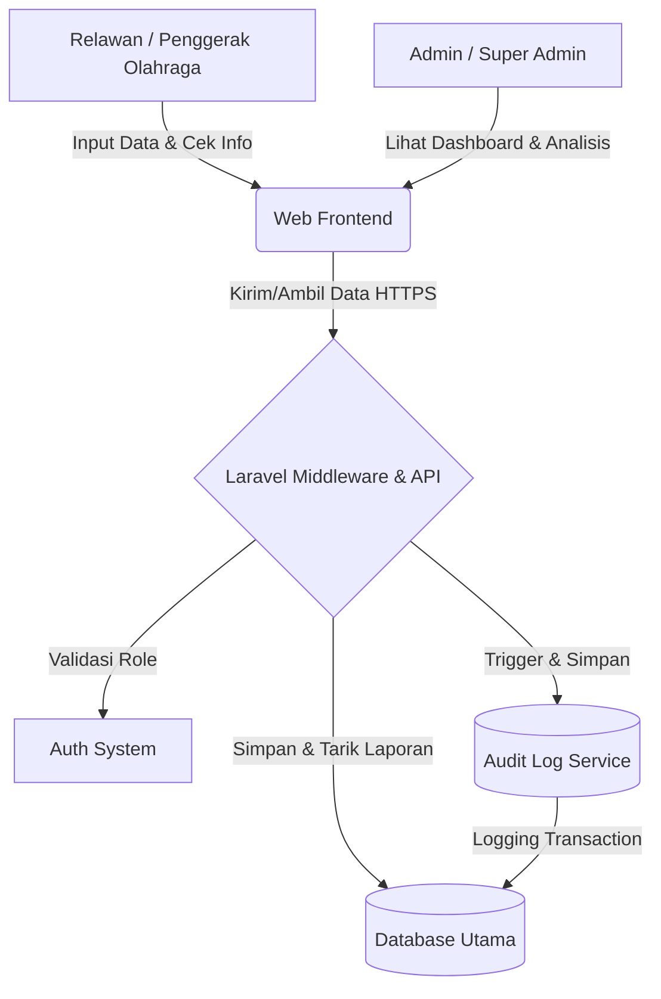

# PRD — Project Requirements Document

## 1. Overview
Saat ini, data mengenai keolahragaan di suatu daerah—seperti jumlah partisipasi masyarakat, kondisi fasilitas, komunitas yang aktif, hingga event dan prestasi—seringkali tersebar dan tidak terorganisir. Hal ini menyulitkan para pemangku kepentingan untuk menganalisis tren dan membuat kebijakan yang tepat sasaran. 

Aplikasi **CPSS (Cloud Participatory Sensing System) Keolahragaan Daerah** hadir untuk memecahkan masalah tersebut. Sistem berbasis website ini berfungsi sebagai wadah tunggal (*single source of truth*) di mana para penggerak olahraga (relawan) dapat melaporkan kondisi riil di lapangan. Dengan semua data terkumpul di satu tempat, admin daerah dapat memantau progres, mencari komunitas, melihat lokasi fasilitas, dan pada akhirnya merumuskan kebijakan keolahragaan yang berbasis data (*data-driven*).

## 2. Requirements
- **Manajemen Hak Akses (Role-Based Access):** Sistem harus mendukung tiga level pengguna, yaitu:
  - **Super Admin:** Mengelola infrastruktur sistem, pengaturan utama, dan manajemen semua admin.
  - **Admin:** Memantau progres daerah, menganalisis data, dan mengelola informasi wilayahnya untuk tujuan pembuatan kebijakan.
  - **Penggerak Olahraga (Relawan):** Aktor utama di lapangan yang bertugas memasukkan (input) data partisipasi, fasilitas, dan event.
- **Kemudahan Akses Ekosistem:** Semua informasi tentang lokasi sarana, aktivitas klub/komunitas, dan event dapat diakses dan dilihat dengan mudah sejak pertama kali pengguna membuka aplikasi.
- **Sistem Pelaporan Tersentralisasi:** Harus mencakup modul pelaporan yang komprehensif (fasilitas, kegiatan rutin, komunitas, prestasi, dan event).
- **Keamanan Tingkat Lanjut (Advanced Security):** Mengingat skala data yang akan terus bertumbuh dan sensitivitas data kebijakan daerah, sistem harus menerapkan:
  - **Sistem Audit Log:** Mencatat setiap aksi mutasi data secara otomatis dan terstruktur (siapa yang mengubah, kapan, tabel/baris target, aksi yang dilakukan, serta nilai sebelum dan sesudah perubahan) untuk menjamin integritas dan akuntabilitas data.
  - **Middleware Role Validation:** Validasi hak akses dilakukan di tingkat edge/middleware server sebelum permintaan diproses lebih lanjut, memastikan pemisahan akses yang ketat dan mencegah manipulasi akses via URL atau request manual.

## 3. Core Features (Existing)
- **Peta & Direktori Keolahragaan (Informasi Cepat):** Fitur untuk langsung melihat lokasi tempat olahraga, daftar komunitas/klub untuk mencari teman, serta jadwal event daerah terbaru.
- **Dashboard Progres Daerah:** Tampilan analitik ringkas bagi Admin dan Super Admin untuk melihat grafik partisipasi masyarakat dan perkembangan keolahragaan dari waktu ke waktu.
- **Pencatatan Partisipasi Masyarakat:** Formulir digital bagi relawan untuk mencatat siapa saja (atau berapa banyak) masyarakat yang sedang berolahraga di suatu area.
- **Manajemen Sarana & Prasarana:** Modul untuk mencatat atau memperbarui kondisi alat olahraga, lokasi aset, status pemakaian, dan informasi kepemilikan sarana daerah.
- **Katalog Komunitas & Prestasi:** Halaman untuk mendaftarkan klub/komunitas olahraga yang ada, lengkap dengan rekam jejak atau prestasi yang telah diraih oleh daerah tersebut.
- **Panel Keamanan & Audit:** Tampilan khusus bagi Super Admin dan Admin untuk meninjau riwayat audit log untuk investigasi anomali atau perubahan data kritis.

## 4. User Flow
Berikut adalah alur perjalanan sederhana dari sudut pandang **Penggerak Olahraga (Relawan)**:
1. **Login:** Relawan masuk ke dalam aplikasi menggunakan akun yang telah diverifikasi.
2. **Eksplorasi (Keuntungan Pertama):** Relawan tiba di halaman utama dan bisa langsung melihat peta/daftar sarana olahraga, komunitas yang ada, dan event terdekat.
3. **Pelaporan (Input Data):** Saat berada di lapangan, relawan menemukan sarana yang rusak atau melihat warga yang sedang senam massal. Relawan membuka menu "Tambah Data" dan mengisi laporan terkait.
4. **Verifikasi Sistem:** Data yang dimasukkan langsung tersimpan, tervalidasi oleh middleware, dan terintegrasi ke dalam *database* pusat.
5. **Pemantauan Admin:** Admin daerah membuka aplikasi, melihat laporan terbaru dari relawan, meninjau audit log perubahan data, melihat grafik progres daerah, dan menggunakan data tersebut sebagai bahan rapat kebijakan.

## 5. Architecture
Aplikasi ini menggunakan pendekatan arsitektur klien-server berbasis web yang sederhana namun andal. Semua lapisan terintegrasi untuk memastikan data pelaporan dapat masuk secara lancar dan ditampilkan secara *real-time* ke dashboard Admin, dengan lapisan keamanan tambahan di edge.



**Alur Keamanan Tambahan:**
- Setiap request dari frontend pertama-tama melewati **Laravel Middleware** yang memeriksa status otentikasi dan validasi role sebelum meneruskan ke Controller.
- Setiap operasi `CREATE`, `UPDATE`, atau `DELETE` yang mengubah data inti akan memicu mekanisme **Audit Logger** yang mencatat metadata perubahan ke tabel `audit_logs` secara sinkron sebelum transaksi commit.

## 6. Database Schema
Untuk mendukung fitur di atas, aplikasi ini membutuhkan tabel penyimpanan data sebagai berikut:

- **Users:** Menyimpan data pengguna dan hak akses (Super Admin, Admin, Relawan).
- **Facilities (Sarana & Prasarana):** Menyimpan lokasi, kondisi sarana, pemakaian, dan pemilik aset.
- **Clubs (Komunitas/Klub):** Menyimpan profil komunitas, kontak, dan fokus cabang olahraga.
- **Events:** Menyimpan jadwal, lokasi, dan deskripsi acara olahraga daerah.
- **Participations:** Menyimpan log partisipasi warga yang dilaporkan oleh relawan.
- **Talenta:** Menyimpan data bibit atlet dan pemetaan talenta regional.
- **Tenaga Ahli:** Menyimpan data pelatih dan penggerak olahraga yang tersertifikasi.
- **Audit Logs:** Menyimpan rekam jejak aktivitas sistem untuk menjaga integritas data dan akuntabilitas perubahan.

```mermaid
erDiagram
    USERS ||--o{ PARTICIPATIONS : "mencatat"
    USERS ||--o{ FACILITIES : "memperbarui"
    USERS ||--o{ AUDIT_LOGS : "memicu"
    USERS ||--o{ EVENTS : "membuat"
    USERS ||--o{ CLUBS : "mengelola"
    
    USERS {
        string id PK
        string name
        string email
        string role "Super Admin, Admin, Relawan"
        boolean mfa_enabled default false
        string mfa_secret nullable
    }
    FACILITIES {
        string id PK
        string name
        string location
        string owner
        string condition "Baik, Rusak Ringan, Rusak Berat"
    }
    CLUBS {
        string id PK
        string name
        string sport_type
        string contact_info
    }
    EVENTS {
        string id PK
        string title
        date event_date
        string location
    }
    PARTICIPATIONS {
        string id PK
        string user_id FK
        int participant_count
        string activity_type
        date log_date
    }
    TALENTA {
        string id PK
        string nama
        string cabang_olahraga
        string asal_daerah
        date tanggal_lahir
    }
    TENAGA_AHLI {
        string id PK
        string nama
        string bidang_keahlian
        string sertifikasi
        string kontak
    }
    AUDIT_LOGS {
        string id PK
        string user_id FK
        string action "CREATE, UPDATE, DELETE"
        string target_table
        string target_id
        json old_value
        json new_value
        timestamp created_at
    }
```

## 7. Tech Stack
Berdasarkan kebutuhan pembuatan solusi lengkap, cepat, dan aman untuk menghadapi skala data yang besar, direkomendasikan menggunakan tumpukan teknologi modern sebagai berikut:
- **Frontend / Aplikasi Visual:** Laravel Blade dipadukan dengan Tailwind CSS untuk pengaturan gaya, dan Chart.js untuk visualisasi data. Alpine.js untuk interaktivitas ringan pada komponen UI.
- **Backend / Logika Sistem:** Laravel 11 dengan Eloquent ORM. Middleware Laravel untuk validasi role dan sesi.
- **Database:** MySQL untuk produksi, SQLite untuk pengembangan lokal. Dikelola dengan Eloquent ORM dan migrations.
- **Keamanan / Otentikasi:** Laravel Breeze sebagai inti otentikasi. Implementasi **Audit Logger** terintegrasi di middleware dan controller untuk menangkap otomatis setiap mutation tanpa mengganggu logika bisnis utama.
- **Deployment / Peluncuran:** Vercel atau shared hosting dengan PHP 8.2+.

---

## 8. Baseline Survey Analysis

Pada Mei–Juni 2026, dilakukan survei baseline terhadap **~40 responden** Tenaga Penggerak Olahraga Nasional (TPON) dari berbagai daerah di Indonesia (termasuk Papua, Maluku, NTT, Lombok, Jawa, dan Sumatera). Survei bertujuan mengidentifikasi kendala lapangan dan kebutuhan sistem digital untuk pengelolaan data keolahragaan.

### 8.1 Profil Responden
- **Peran:** Pelatih (~30%), Tenaga Penggerak Olahraga (~40%), Relawan (~15%), Lainnya (~15%)
- **Pengalaman:** Mayoritas >3 tahun dan 1–3 tahun
- **Akses Internet:** Sebagian besar memiliki akses internet memadai (nilai 4–5), namun ada keluhan signifikan terkait stabilitas jaringan di daerah kepulauan dan Papua.

### 8.2 Temuan Kuantitatif Utama (Skala 1–5)
| Indikator | Rata-rata | Interpretasi |
|-----------|-----------|--------------|
| Pencatatan masih manual | 4.2 | Sangat tinggi, mayoritas masih pakai kertas/Excel |
| Butuh sistem digital | 4.8 | Hampir semua responden sangat setuju |
| Sistem harus mudah digunakan | 4.9 | Prioritas utama: UX sederhana |
| Harus bisa diakses via smartphone | 4.7 | Mobile-first adalah keharusan |
| Butuh fitur monitoring perkembangan | 4.6 | Dashboard/visualisasi sangat dibutuhkan |
| Butuh sistem real-time | 4.5 | Sinkronisasi data cepat diharapkan |
| Siap pakai sistem baru | 4.6 | Adopsi tidak menjadi masalah |
| Data tidak terdokumentasi dengan baik | 3.8 | Masalah nyata di lapangan |
| Tidak ada sistem terintegrasi | 3.5 | Fragmentasi data masih tinggi |

### 8.3 Kendala Terbesar di Lapangan (Tematik)
1. **Pencatatan Manual & Tidak Terstruktur** — Data peserta, absensi, dan evaluasi masih di kertas, buku kas, atau grup WA. Rawan hilang, rusak, dan sulit direkap.
2. **Tidak Ada Sistem Terintegrasi** — Data tersebar di berbagai dokumen, tidak ada "single source of truth".
3. **Sulit Memantau Perkembangan (Retention Rate)** — Tidak bisa melacak siapa yang rutin hadir, kapan partisipasi mulai menurun, dan kelompok usia mana yang paling aktif.
4. **Keterbatasan SDM & Waktu** — Panitia/relawan sukarela dengan waktu terbatas, butuh sistem yang mengurangi beban administrasi.
5. **Tidak Ada Laporan & Evaluasi Otomatis** — Rekap data ke RT/Kelurahan/pemerintah masih manual dan memakan waktu.
6. **Akses Internet Tidak Stabil** — Khususnya di daerah kepulauan (Maluku, Papua) dan pelosok desa.

### 8.4 Fitur yang Paling Sering Diminta (Word Cloud / Frekuensi)
1. **Absensi Digital / Pencatatan Kehadiran** (~85% responden)
2. **Dashboard Visual & Grafik Perkembangan** (~80%)
3. **Jadwal Kegiatan & Pengingat Otomatis** (~75%)
4. **Laporan Otomatis (Export PDF/Excel)** (~70%)
5. **Dokumentasi Foto/Video Kegiatan** (~65%)
6. **Database Peserta dengan Demografi** (~60%)
7. **Feedback / Survei Kepuasan Peserta** (~55%)
8. **Pemetaan GIS / Peta Fasilitas** (~50%)
9. **Manajemen Cedera / Insiden** (~40%)
10. **Kemampuan Offline / Semi-Offline** (~35%)

---

## 9. Gap Analysis — Fitur Sudah Ada vs. Belum Ada

### 9.1 Fitur yang SUDAH ADA ✅
| Fitur | Keterangan | Kecocokan dengan Survei |
|-------|------------|------------------------|
| RBAC (Super Admin, Admin, Relawan) | 3 level akses sesuai hierarki | ✅ Sesuai |
| Audit Log | Pencatatan mutasi data otomatis | ✅ Sesuai (akuntabilitas) |
| Dashboard Chart.js | Grafik tren partisipasi, kondisi prasarana, partisipasi by usia | ✅ Sesuai |
| Manajemen Prasarana | Rating kondisi 1-5 + fasilitas tambahan (disabilitas, parkir, dll) | ✅ Sesuai |
| Manajemen Club/Komunitas | CRUD + jadwal latihan + relasi ke prasarana | ✅ Sesuai |
| Manajemen Event | Pencatatan event multi-tingkat (Desa–Kabupaten) | ✅ Sesuai |
| Manajemen Partisipasi | Estimasi jumlah & mayoritas usia per observasi | ⚠️ Parsial (hanya estimasi, tidak per individu) |
| Manajemen Talenta | Database bibit atlet | ✅ Sesuai |
| Manajemen Tenaga Ahli | Data pelatih & penggerak | ✅ Sesuai |
| Responsive Design | Mobile-friendly via Tailwind | ✅ Sesuai |

### 9.2 Fitur yang BELUM ADA ❌ (HIGH PRIORITY — Segera Dibangun)
| # | Fitur | Justifikasi dari Survei | Dampak |
|---|-------|------------------------|--------|
| 1 | **Absensi Digital per Individu** | Hampir semua responden (~85%) meminta absensi digital/QR. Saat ini hanya ada estimasi jumlah total. | 🔴 Kritis |
| 2 | **Database Peserta (Master Data Individu)** | Perlu nama, usia, gender, kelompok sasaran, kontak, riwayat kehadiran. Saat ini tidak ada tabel peserta. | 🔴 Kritis |
| 3 | **Export Laporan Otomatis (PDF/Excel)** | Banyak yang meminta "1 klik export" untuk laporan ke RT/Kelurahan. Saat ini tidak ada fitur export. | 🔴 Kritis |
| 4 | **Dokumentasi Kegiatan (Galeri Foto/Video)** | Responden butuh arsip visual untuk branding desa/kampung dan evaluasi. | 🟠 Tinggi |
| 5 | **Notifikasi / Pengingat Jadwal** | Diminta untuk mengingatkan peserta H-1 via WA/notifikasi. Saat ini tidak ada. | 🟠 Tinggi |
| 6 | **Feedback & Survei Kepuasan Peserta** | Perlu mekanisme bottom-up agar program relevan. Saat ini tidak ada. | 🟠 Tinggi |
| 7 | **Pemetaan GIS / Peta Interaktif** | Banyak yang minta "pemetaan talenta regional" dan "peta fasilitas". Saat ini tidak ada peta. | 🟠 Tinggi |

### 9.3 Fitur yang BELUM ADA ❌ (MEDIUM PRIORITY)
| # | Fitur | Justifikasi | Dampak |
|---|-------|-------------|--------|
| 8 | **Manajemen Cedera / Insiden / Risiko** | Beberapa responden meminta pencatatan kejadian cedera saat kegiatan. | 🟡 Menengah |
| 9 | **Task Management / Pembagian Tugas Panitia** | Koordinasi tim agar tidak bergantung 1 orang. | 🟡 Menengah |
| 10 | **Kemampuan Offline / PWA** | Internet tidak stabil di daerah terpencil (Papua, Maluku). | 🟡 Menengah |
| 11 | **LMS / Materi Pelatihan & Sertifikasi** | Disebut oleh responden sebagai kebutuhan pelatih akar rumput. | 🟡 Menengah |
| 12 | **Halaman Publik / Promosi Kegiatan** | Untuk "memotret dan menyuguhkan" manfaat olahraga ke masyarakat. Saat ini web bersifat admin-only. | 🟡 Menengah |

### 9.4 Fitur yang BELUM ADA ❌ (LOW PRIORITY / FUTURE)
| # | Fitur | Justifikasi | Dampak |
|---|-------|-------------|--------|
| 13 | **AI / Prediksi Performa Atlet** | Disebut 1–2 responden, memerlukan data historis besar. | 🟢 Rendah |
| 14 | **Sertifikasi Digital Otomatis** | Disebut 1–2 responden. | 🟢 Rendah |
| 15 | **Kalkulator Indeks Pembangunan Olahraga (SDI)** | Disebut 1 responden, memerlukan formula nasional. | 🟢 Rendah |
| 16 | **Integrasi Tracker Fisik Personal** | Beberapa sudah pakai Strava/MI Fitness, tidak perlu duplikasi. | 🟢 Rendah |

---

## 10. Rekomendasi Database Schema (Future Tables)

Berdasarkan gap analysis, berikut tabel-tabel yang direkomendasikan untuk iterasi berikutnya:

### 10.1 Peserta (Participants) — 🔴 PRIORITAS TINGGI
```
- id (PK)
- nama_lengkap
- jenis_kelamin (L/P)
- tanggal_lahir → usia otomatis
- kelompok_usia (Anak, Remaja, Dewasa, Lansia)
- alamat / desa / kelurahan
- no_telepon
- email (nullable)
- kategori_khusus (disabilitas, lansia, ibu hamil, dll)
- club_id (FK, nullable)
- created_by (user_id FK)
- timestamps
```

### 10.2 Kehadiran (Attendances) — 🔴 PRIORITAS TINGGI
```
- id (PK)
- event_id atau club_id (polymorphic atau nullable)
- participant_id (FK)
- tanggal_kehadiran
- status (Hadir, Izin, Sakit, Alfa)
- metode_absensi (manual, qr_code, link)
- catatan (nullable)
- created_by (user_id FK)
- timestamps
```

### 10.3 Dokumentasi Kegiatan (Galleries) — 🟠 PRIORITAS TINGGI
```
- id (PK)
- event_id atau club_id (polymorphic)
- tipe (foto, video)
- file_path
- caption / deskripsi
- taken_by (user_id FK)
- taken_at (datetime)
- timestamps
```

### 10.4 Evaluasi / Feedback (Feedbacks) — 🟠 PRIORITAS TINGGI
```
- id (PK)
- event_id (FK, nullable)
- participant_id (FK, nullable — untuk anonim bisa nullable)
- rating_kepuasan (1-5)
- rating_kesulitan (1-5)
- saran (text)
- hambatan (text)
- timestamps
```

### 10.5 Laporan (Reports) — 🟠 PRIORITAS TINGGI
```
- id (PK)
- judul_laporan
- periode_mulai, periode_selesai
- tipe_laporan (partisipasi, prasarana, event, komprehensif)
- format (pdf, excel)
- file_path (hasil export)
- generated_by (user_id FK)
- timestamps
```

### 10.6 Peta / Lokasi (Locations) — 🟡 PRIORITAS MENENGAH
```
- id (PK)
- nama_lokasi
- latitude, longitude
- tipe (prasarana, event, cluster_peserta)
- deskripsi
- timestamps
```

### 10.7 Cedera / Insiden (Incidents) — 🟡 PRIORITAS MENENGAH
```
- id (PK)
- event_id (FK, nullable)
- participant_id (FK, nullable)
- jenis_insiden (cedera, kerusakan_fasilitas, lainnya)
- deskripsi
- tingkat_keparahan (ringan, sedang, berat)
- tindakan (text)
- reported_by (user_id FK)
- timestamps
```

---

## 11. Roadmap Implementasi (Iteratif)

### Fase 1 — Foundation Fix (Sprint 1–2)
**Fokus:** Menutup gap paling kritis yang menghambat operasional lapangan.
- [ ] **Modul Master Peserta:** CRUD peserta individu dengan demografi (nama, usia, gender, kelompok, alamat, kategori khusus).
- [ ] **Absensi Digital:** Integrasi absensi per event/club (bisa manual checklist atau QR code sederhana).
- [ ] **Relasi Partisipasi → Peserta:** Ubah partisipasi dari estimasi jumlah menjadi agregasi dari data absensi (tetap simpan fitur estimasi cepat untuk situasi darurat).
- [ ] **Export Laporan Sederhana:** Export data partisipasi, absensi, dan prasarana ke Excel/PDF.

### Fase 2 — Engagement & Monitoring (Sprint 3–4)
**Fokus:** Meningkatkan keterlibatan masyarakat dan kemudahan monitoring.
- [ ] **Dokumentasi Kegiatan (Galeri):** Upload foto/video per event/club dengan caption.
- [ ] **Notifikasi / Pengingat:** Integrasi WhatsApp Gateway atau email reminder untuk jadwal event (H-1 dan H-0).
- [ ] **Feedback / Survei Kepuasan:** Form evaluasi singkat (1–3 pertanyaan) pasca-event dengan skor kepuasan.
- [ ] **Dashboard Retention Analytics:** Grafik kehadiran per individu, deteksi penurunan partisipasi (anomaly warning), demografi peserta.

### Fase 3 — Geographic & Public Outreach (Sprint 5–6)
**Fokus:** Eksplorasi spasial dan publikasi ke masyarakat.
- [ ] **Pemetaan GIS:** Integrasi Leaflet.js/OpenStreetMap untuk menampilkan lokasi prasarana, event, dan sebaran klub.
- [ ] **Halaman Publik (Landing Page):** Galeri kegiatan, testimoni, jadwal event publik, dan direktori klub yang bisa diakses tanpa login.
- [ ] **Manajemen Cedera/Insiden:** Form pelaporan kejadian saat kegiatan.

### Fase 4 — Advanced & Scale (Sprint 7+)
**Fokus:** Fitur lanjutan dan skalabilitas.
- [ ] **PWA / Offline Capability:** Service worker untuk sinkronisasi data saat offline (penting untuk daerah terpencil).
- [ ] **LMS / Materi Pelatihan:** Modul edukasi pelatih dengan sertifikasi sederhana.
- [ ] **AI / Prediksi (Opsional):** Prediksi tren partisipasi atau risiko cedera berdasarkan data historis.

---

## 12. Kesimpulan & Rekomendasi Strategis

**CPSS saat ini telah memiliki fondasi teknis yang kuat** dengan RBAC, audit log, dashboard visual, manajemen prasarana, klub, event, talenta, dan tenaga ahli. Namun, berdasarkan hasil survei baseline terhadap ~40 tenaga penggerak olahraga nasional, **terdapat kesenjangan signifikan antara fitur yang ada dengan kebutuhan operasional lapangan**.

### Kesenjangan Paling Kritis:
1. **Dari "Estimasi" ke "Individu":** Saat ini partisipasi hanya mencatat estimasi jumlah orang. Survei menunjukkan **85% responden membutuhkan absensi digital per individu** untuk melacak retention, demografi, dan evaluasi program.
2. **Dari "Input" ke "Laporan":** Tidak ada fitur export laporan. Relawan butuh "1 klik export" untuk pertanggungjawaban ke pemerintah daerah.
3. **Dari "Data" ke "Cerita":** Tidak ada modul dokumentasi visual dan publikasi. Padahal survei menunjukkan penggerak olahraga sangat membutuhkan media untuk "memotret dan menyuguhkan" manfaat olahraga agar masyarakat termotivasi.

### Rekomendasi:
- **Prioritaskan Fase 1 (Master Peserta + Absensi + Export)** karena ini adalah penghambat operasional paling besar yang disebutkan oleh hampir semua responden.
- **Pertahankan prinsip UX sederhana dan mobile-first** karena survei menunjukkan nilai 4.9/5 untuk "sistem harus mudah digunakan" dan 4.7/5 untuk "harus bisa diakses via smartphone".
- **Pertimbangkan dukungan semi-offline** lebih awal jika target rollout mencakup daerah Papua dan Maluku.

---

*Document Version: 2.0*
*Last Updated: 19 Juni 2026*
*Baseline Survey Reference: "Baseline Tenaga Penggerak Olahraga Nasional" (Mei–Juni 2026)*
